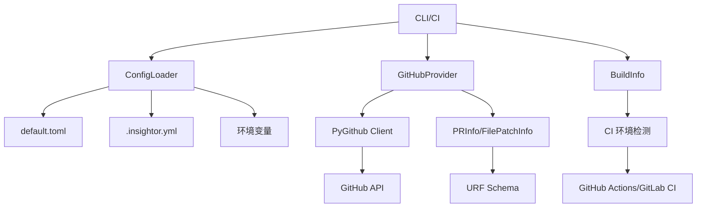

# Insightor Full Review — PR #4

> 生成时间: 2026-05-30 08:31 UTC | 模型: claude-sonnet-4-6 | 深度: standard
> PR: https://github.com/SCU-GuGuGaGa/Insightor/pull/4

---

## 1. PR 总结 (describe)

- **类型**: feature
- **概述**: 搭建项目工程骨架，实现 GitHub PR 数据获取与四级配置系统

### 变更文件

| 操作 | 文件 | 说明 |
|------|------|------|
| modified | `insightor/__init__.py` | 定义包版本号 |
| modified | `insightor/config/loader.py` | 四级配置加载器实现 |
| modified | `insightor/config/default.toml` | 全局默认配置 |
| modified | `insightor/environment/buildinfo.py` | CI 环境自动检测 |
| modified | `insightor/providers/types.py` | PR/文件/提交数据类定义 |
| modified | `insightor/providers/protocols.py` | GitProvider 协议抽象 |
| modified | `insightor/providers/github_provider.py` | GitHub API 封装实现 |
| modified | `insightor/schemas/urf.py` | 统一审查结果 Schema |
| modified | `tests/test_buildinfo.py` | CI 检测单元测试 |
| modified | `tests/test_config_loader.py` | 配置加载单元测试 |
| modified | `tests/test_github_provider.py` | GitHub Provider Mock 测试 |
| modified | `tests/test_schemas_urf.py` | URF Schema 验证测试 |
| modified | `pyproject.toml` | 项目依赖与构建配置 |
| modified | `.env.example` | 环境变量模板 |
| modified | `.insightor.example.yml` | 项目配置示例 |
| modified | `.gitignore` | 忽略缓存与构建产物 |

### 组件交互图



---

## 2. 风险分析 (risks)

- **评分**: ⚠️ 67/100 — needs_review
- 发现 2 个 high 级别安全问题（token 泄露风险、ReDoS）和多个 medium 级别问题（配置安全、异常处理、API 限制），需修复后合并

### 风险发现 (10)

#### 1. 🟡 [high] GitHub Token 可能通过无认证客户端泄露

- **类别**: security
- **文件**: `insightor/providers/github_provider.py:56`
- **说明**: GitHubProvider.__init__ 在无 token 时创建无认证客户端，但后续 _get_headers() 方法仍会尝试从环境变量读取 token。这导致初始化时声称「无认证」，但实际请求时可能携带 token，造成认证状态不一致。若攻击者能控制环境变量但无法控制初始化参数，可能绕过认证检查。
- **置信度**: 85%

#### 2. 🟡 [high] 正则表达式存在 ReDoS 风险

- **类别**: security
- **文件**: `insightor/providers/github_provider.py:23`
- **说明**: _PR_URL_RE 使用 `(\S[^/]+)` 模式匹配 owner/repo，当输入包含大量非空白字符但不含斜杠时（如 'github.com/aaaaaaa...[10000个a]'），回溯次数呈指数增长，可能导致 CPU 100% 占用。
- **置信度**: 90%

#### 3. 🔵 [medium] 环境变量自动加载可能引入非预期配置

- **类别**: security
- **文件**: `insightor/config/loader.py:10`
- **说明**: config/loader.py 在模块导入时执行 load_dotenv()，若项目目录存在恶意 .env 文件（如通过 PR 提交），会在代码审查工具运行时自动加载，可能覆盖 GITHUB_TOKEN 等敏感配置。
- **置信度**: 80%

#### 4. 🔵 [medium] YAML 配置文件解析未限制对象类型

- **类别**: security
- **文件**: `insightor/config/loader.py:54`
- **说明**: load_project_config 使用 yaml.safe_load() 是正确的，但未验证加载后的数据结构。若 .insightor.yml 包含恶意构造的嵌套结构（如循环引用或超大列表），可能导致内存耗尽或后续处理逻辑异常。
- **置信度**: 75%

#### 5. 🔵 [medium] PR URL 解析逻辑不一致

- **类别**: logic
- **文件**: `insightor/providers/github_provider.py:23`
- **说明**: parse_pr_url 函数定义了正则 _PR_URL_RE，但实际使用时重新编写了不同的正则表达式（第 36 行），导致两个正则不一致。若后续维护只更新其中一个，会产生难以排查的 bug。
- **置信度**: 95%

#### 6. 🔵 [medium] GitHub API 异常处理丢失错误上下文

- **类别**: data_loss
- **文件**: `insightor/providers/github_provider.py:120`
- **说明**: get_commits 和 get_issue_context 捕获 GithubException 后仅记录 warning 并返回空列表，调用方无法区分「真的没有数据」和「API 调用失败」。若因权限问题导致静默失败，用户会误以为 PR 没有关联 commits/issues。
- **置信度**: 85%

#### 7. 🔵 [medium] 未对 GitHub API 分页结果进行限制

- **类别**: performance
- **文件**: `insightor/providers/github_provider.py:96`
- **说明**: get_files 和 get_commits 调用 pr.get_files() 和 pr.get_commits() 时未设置分页限制。若 PR 包含数千个文件或提交（如 monorepo 的大型重构），会触发数百次 API 请求并消耗大量内存。
- **置信度**: 80%

#### 8. ⚪ [low] 正则表达式未锚定可能匹配非预期内容

- **类别**: security
- **文件**: `insightor/providers/github_provider.py:36`
- **说明**: parse_pr_url 的正则未使用 ^ 和 $ 锚定，可能匹配 URL 中间部分。例如 'https://evil.com?redirect=github.com/owner/repo/pull/123' 会被错误解析。
- **置信度**: 70%

#### 9. ⚪ [low] 环境检测逻辑可能误判 CI 环境

- **类别**: logic
- **文件**: `insightor/environment/buildinfo.py:84`
- **说明**: _detect_generic 中，只要存在 pr/owner/repo 任一变量就设置 ci_system='unknown'，但这些变量可能被用户本地设置用于其他目的，导致误判为 CI 环境。
- **置信度**: 65%

#### 10. ⚪ [low] 配置覆盖逻辑每次调用都重新合并字典

- **类别**: performance
- **文件**: `insightor/config/loader.py:69`
- **说明**: ConfigLoader.get() 每次调用都执行 _apply_project_overrides() 重新构建 merged 字典。若在循环中频繁调用 get()（如处理数百个文件时读取配置），会产生不必要的字典复制开销。
- **置信度**: 70%

---

## 3. 代码审查 (review)

- **评分**: ⚠️ 67/100 — needs_review
- 核心功能实现完整且测试覆盖良好，但存在安全风险（token 泄露）、逻辑缺陷（配置覆盖不一致、diff 获取不完整）和性能隐患（大 diff 处理）需要修复

### 发现 (11)

#### 1. 🟡 [high] GitHub Token 可能通过日志泄露 <!-- finding-id: 6229fb42-bf8a-403b-8170-5809857e80fd -->

- **类别**: security
- **文件**: `insightor/providers/github_provider.py:189`
- **说明**: 在 `_get_headers()` 方法中直接从环境变量读取 token 并构造 headers，如果后续代码记录了 headers 内容，会导致 token 泄露。建议在日志配置中明确过滤 Authorization header。
- **建议代码**:
  ```
  添加日志过滤器或在构造 headers 时添加注释警告，确保下游代码不会记录敏感信息
  ```
- **置信度**: 75%

- [x] confirmed
- [ ] false_positive
- [ ] addressed
- [ ] ignored
- **审查者:** 
- **备注:** 

#### 2. 🔵 [medium] parse_pr_url 正则表达式过于宽松 <!-- finding-id: 42cdad4b-2d88-4f7a-aa1b-00090daf0331 -->

- **类别**: logic
- **文件**: `insightor/providers/github_provider.py:38`
- **说明**: 正则 `r"github\.[^/]+/([^/]+)/([^/]+)/pull/(\d+)"` 会匹配 `github.anything/...`，可能误匹配非 GitHub 域名。建议限定为 `github\.com` 或 `github\.[a-z0-9-]+\.[a-z]+`。
- **建议代码**:
  ```
  改为 `r"github\.(?:com|[a-z0-9-]+\.[a-z]+)/([^/]+)/([^/]+)/pull/(\d+)"`
  ```
- **置信度**: 70%

- [x] confirmed
- [ ] false_positive
- [ ] addressed
- [ ] ignored
- **审查者:** 
- **备注:** 

#### 3. 🔵 [medium] get_diff 实现不完整且有性能风险 <!-- finding-id: 90a4e2b4-eb4a-4908-8474-54dbd322d933 -->

- **类别**: performance
- **文件**: `insightor/providers/github_provider.py:163`
- **说明**: `get_diff()` 方法在 PyGithub 的 diff 属性失败后直接返回空字节，未尝试备用方案（如注释中提到的 raw diff URL）。对于大型 PR，diff 可能非常大，应考虑流式处理或分块加载。
- **建议代码**:
  ```
  实现备用的 HTTP 请求获取 diff，并添加 diff 大小限制（如 10MB）和超时控制
  ```
- **置信度**: 85%

- [x] confirmed
- [ ] false_positive
- [ ] addressed
- [ ] ignored
- **审查者:** 
- **备注:** 

#### 4. 🔵 [medium] get_issue_context 异常处理过于宽泛 <!-- finding-id: 9fe09776-dc8a-4afe-8807-e49ebc5b6cdf -->

- **类别**: logic
- **文件**: `insightor/providers/github_provider.py:155`
- **说明**: 捕获所有 `GithubException` 并静默忽略，可能掩盖认证失败、权限不足等重要错误。建议区分处理 404（issue 不存在）和其他错误（如 401/403）。
- **建议代码**:
  ```
  区分 UnknownObjectException（404）和其他异常，对认证/权限错误向上抛出或记录 warning
  ```
- **置信度**: 80%

- [x] confirmed
- [ ] false_positive
- [ ] addressed
- [ ] ignored
- **审查者:** 
- **备注:** 

#### 5. 🔵 [medium] ConfigLoader 环境变量覆盖逻辑有缺陷 <!-- finding-id: 9a53016c-7772-4c04-b8f6-f02a67ad508a -->

- **类别**: logic
- **文件**: `insightor/config/loader.py:88`
- **说明**: `_get_env()` 在 `get()` 方法中最先检查，但在 `get_section()` 中未应用环境变量覆盖，导致两个方法行为不一致。
- **建议代码**:
  ```
  在 `get_section()` 中也应用环境变量覆盖，或明确文档说明 get_section 不支持环境变量
  ```
- **置信度**: 90%

- [x] confirmed
- [ ] false_positive
- [ ] addressed
- [ ] ignored
- **审查者:** 
- **备注:** 

#### 6. ⚪ [low] BuildInfo 的 PR 编号解析可能失败 <!-- finding-id: e7437fbb-a0fc-414e-b203-28f1538bab3d -->

- **类别**: logic
- **文件**: `insightor/environment/buildinfo.py:80`
- **说明**: `_get_github_pr_number()` 在读取 event JSON 失败后，尝试从 `GITHUB_REF` 解析，但逻辑不完整（只检查前缀，未实际解析数字）。
- **建议代码**:
  ```
  补充 `GITHUB_REF` 的正则解析：`re.search(r'refs/pull/(\d+)/', os.environ.get('GITHUB_REF', '')).group(1)`
  ```
- **置信度**: 85%

- [x] confirmed
- [ ] false_positive
- [ ] addressed
- [ ] ignored
- **审查者:** 
- **备注:** 

#### 7. 🔵 [medium] 全局 load_dotenv 可能影响性能 <!-- finding-id: 8c7a34e8-578f-4450-ad91-2f3fd4e5b83b -->

- **类别**: performance
- **文件**: `insightor/config/loader.py:10`
- **说明**: `config/loader.py` 在模块顶层调用 `load_dotenv()`，每次导入都会执行文件 I/O。建议移到 `__init__` 或使用懒加载。
- **建议代码**:
  ```
  将 `load_dotenv()` 移到 `ConfigLoader.__init__` 中，或使用 `load_dotenv(override=False)` 避免重复加载
  ```
- **置信度**: 70%

- [x] confirmed
- [ ] false_positive
- [ ] addressed
- [ ] ignored
- **审查者:** 
- **备注:** 

#### 8. 🔵 [medium] FilePatchInfo.tokens 默认值为 -1 容易误用 <!-- finding-id: ee6938d2-1bf5-4563-9867-95c0e4a83662 -->

- **类别**: logic
- **文件**: `insightor/providers/types.py:25`
- **说明**: tokens 字段默认 -1 表示未计算，但下游代码可能误将其作为有效值参与计算。建议使用 `None` 或添加 `is_tokens_calculated` 标志。
- **建议代码**:
  ```
  改为 `tokens: int | None = None`，并在文档中说明 None 表示未计算
  ```
- **置信度**: 75%

- [x] confirmed
- [ ] false_positive
- [ ] addressed
- [ ] ignored
- **审查者:** 
- **备注:** 

#### 9. ⚪ [low] URF Schema 中的 clamp 逻辑未实现 <!-- finding-id: 88f1a7a5-9f09-40e2-83f5-f741a53d1820 -->

- **类别**: style
- **文件**: `insightor/schemas/urf.py:172`
- **说明**: PR 描述中提到评分规则 `final = clamp(score, 0, 100)`，但 `MergeReadiness.score` 只有 Pydantic 的 `ge=0, le=100` 约束，未实现实际的 clamp 计算逻辑。
- **建议代码**:
  ```
  添加 `@field_validator('score')` 实现 clamp，或在评分计算模块中处理
  ```
- **置信度**: 65%

- [x] confirmed
- [ ] false_positive
- [ ] addressed
- [ ] ignored
- **审查者:** 
- **备注:** 

#### 10. ℹ️ [info] 测试覆盖率高但缺少集成测试 <!-- finding-id: 4ea72079-275e-45fd-916b-a22ea3b4c033 -->

- **类别**: logic
- **文件**: `tests/test_github_provider.py:1`
- **说明**: 单元测试覆盖了 URL 解析、类型默认值和 Mock 方法，但缺少真实 GitHub API 的集成测试（虽然 PR 描述提到手动验证了真实 PR）。
- **建议代码**:
  ```
  添加可选的集成测试（使用 pytest marker 如 @pytest.mark.integration），在 CI 中通过环境变量控制是否运行
  ```
- **置信度**: 80%

- [x] confirmed
- [ ] false_positive
- [ ] addressed
- [ ] ignored
- **审查者:** 
- **备注:** 

#### 11. ℹ️ [info] 部分文件缺少 docstring <!-- finding-id: 7a30ecc9-2ed3-4408-a52c-e7314314d02b -->

- **类别**: style
- **文件**: `insightor/config/loader.py:41`
- **说明**: `insightor/providers/protocols.py` 中的 Protocol 方法有文档，但 `insightor/config/loader.py` 的部分内部方法（如 `_apply_project_overrides`）缺少说明。
- **建议代码**:
  ```
  为内部方法添加简短的 docstring，说明其作用和返回值
  ```
- **置信度**: 60%

- [x] confirmed
- [ ] false_positive
- [ ] addressed
- [ ] ignored
- **审查者:** 
- **备注:** 

---

## 反馈说明

请根据实际情况勾选以上 **代码审查 (第3节)** 的反馈。确认后运行发布脚本:

```bash
insightor publish insightor-full-review-4.md
```

<!-- insightor-full-review -->
<!-- insightor-pr-url: https://github.com/SCU-GuGuGaGa/Insightor/pull/4 -->